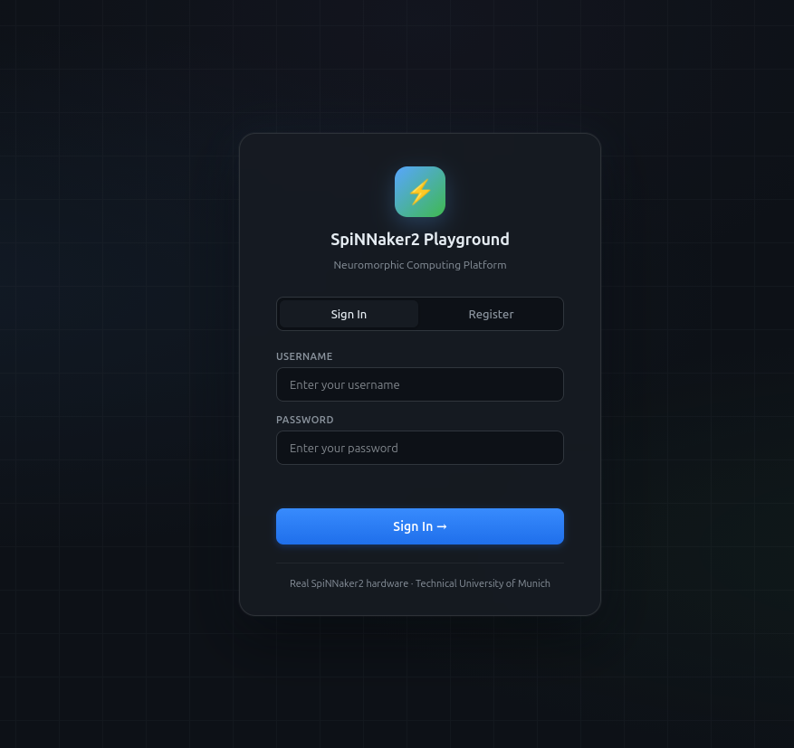
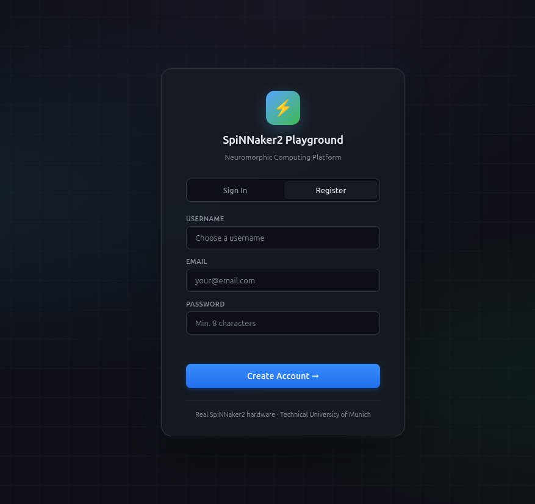
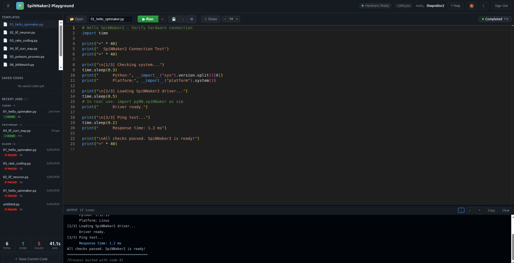
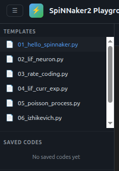
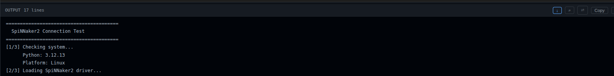
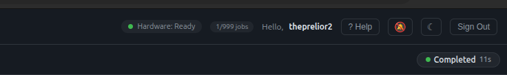
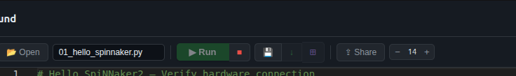

# SpiNNaker2 Web Platform — User Guide

---

## 1. Accessing the Platform

Open your browser and go to:

```
http://<tailscale-ip>:8000
```

You will see the login screen.



---

## 2. Creating an Account

Click **Register** and fill in your username, email, and password.



> If registration is disabled, ask the admin to create an account for you.

---

## 3. The Main Interface

After logging in you will see the main editor.



The interface has three main areas:

| Area | Description |
|------|-------------|
| **Left sidebar** | Templates and saved code snippets |
| **Center editor** | Monaco code editor (Python) |
| **Bottom panel** | Live terminal output and results |

---

## 4. Writing and Running Code

### Option A — Write from scratch

Type your Python code directly in the editor.

### Option B — Load a template

Click a template in the left sidebar to load an example SpiNNaker2 script.



### Running

Press **▶ Run** or `Ctrl+Enter`. The job is submitted to Slurm and output appears live in the terminal panel.



---

## 5. Hardware Status Indicator

The top-right corner shows the current hardware state:

| Status | Meaning |
|--------|---------|
| 🟢 **Online** | Board is idle, ready to accept jobs |
| 🟡 **Busy** | A job is running (web or admin) |
| 🔴 **Offline** | Board or Slurm is unreachable |



If the status is **Busy**, your job will queue automatically and run when the board is free.

---

## 6. Viewing Results

When a job finishes, click **View Results** to see output files and plots inline.


Use **Download** to save all output files as a zip archive.

---

## 7. Stopping a Job

Press **■ Stop** to cancel the running job. Slurm will terminate it immediately.



---

## 8. Saving Your Code

Press **💾 Save** (or `Ctrl+S`) to save the current editor content.
Saved snippets appear in the **Saved Codes** section of the sidebar.


---

## 9. Plotting

Scripts run headless — `plt.show()` is intercepted automatically and plots are saved as PNG files. You do not need to add `savefig` calls manually.

```python
import matplotlib.pyplot as plt
import numpy as np

x = np.linspace(0, 2 * np.pi, 100)
plt.plot(x, np.sin(x))
plt.title("Sine wave")
plt.show()   # ← saved automatically as figure_1.png
```

---

## 10. Job Limits

| Limit | Default |
|-------|---------|
| Max jobs per hour | 10 |
| Max job wall time | 30 minutes |
| Max simultaneous jobs per user | 1 |

If you exceed the hourly limit you will see a `429 Too Many Requests` error.
If your job exceeds the wall time limit, Slurm will terminate it automatically.

---

## 11. Tips

- **Admin jobs take priority.** If an SSH admin starts a job while yours is running,
  your job will be requeued and restarted automatically when the admin is done.
- **Use `print()` for output.** The live terminal shows stdout/stderr from your script.
- **Large simulations:** if your job needs more than 30 minutes, ask the admin to
  submit it directly with `adminqos`.
